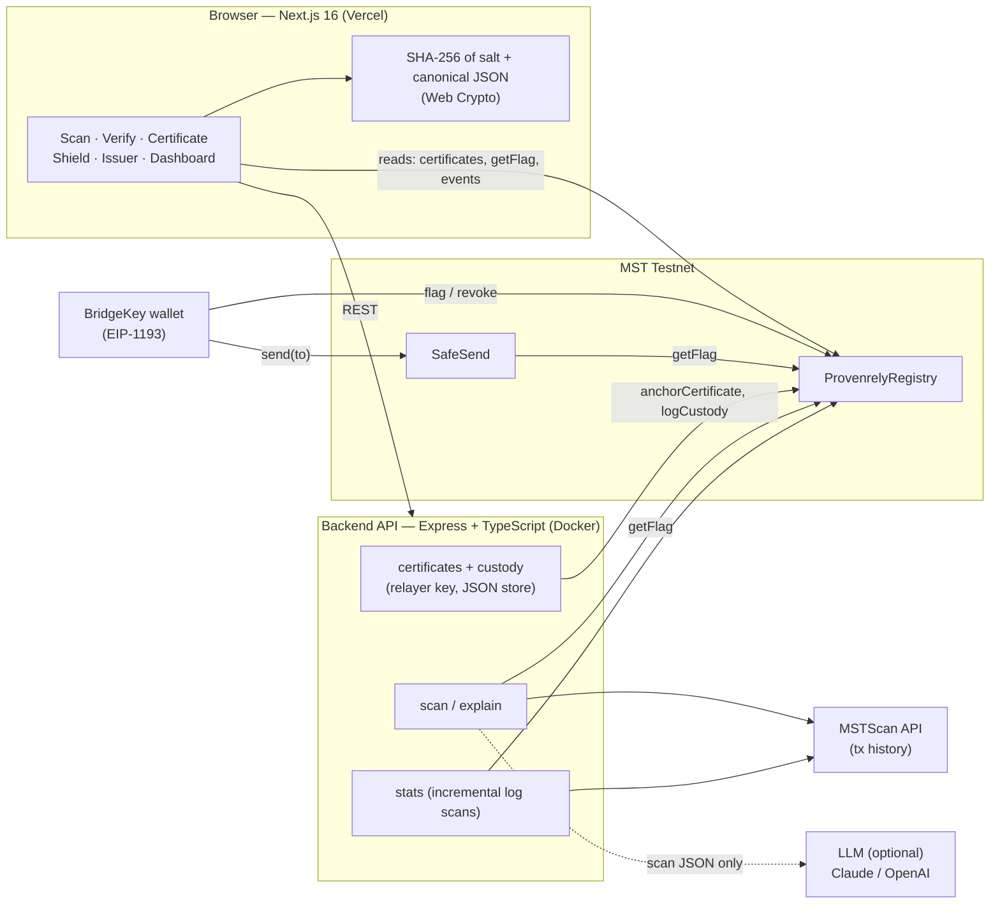

# Provenrely

**Check a crypto address before you pay, prove what you found, and show who handled the proof — anchored on MST.**

Built for the MST Blockchain x Newrro Buildathon. Runs on **MST Testnet** (chain ID `91562037`). It is a working
prototype: a scan is a risk signal, not a guarantee, and never a replacement for reporting fraud.

- Live demo: _TODO — add the Vercel URL_
- Demo video: _TODO — add the link_
- Deployment guide: [DEPLOYMENT.md](DEPLOYMENT.md) · Submission pack: [SUBMISSION.md](SUBMISSION.md)

## The problem

Crypto scam victims usually learn an address was a scam only after the money is gone. Before a transfer there is no
simple way to check the recipient, nothing stops a payment to an address others have already reported, and after
the fact, screenshots and reports can be edited — so evidence handed to the police (helpline **1930**,
[cybercrime.gov.in](https://cybercrime.gov.in)) or a bank is easy to dispute.

## Three layers

| Layer | When | What it does |
|---|---|---|
| **Shield** | before a transfer | Accountable issuers flag scam addresses in an on-chain registry. `SafeSend` forwards tMSTC but **reverts on-chain** if the recipient has an active flag. The wallet UI warns first (reason, issuer, expiry). |
| **Certificate** | investigating an address | A scan (verdict, score 0–100, reasons) is explained in plain **English or Hindi** and sealed into a certificate. Its salted SHA-256 hash is **anchored on MST**. Anyone can verify it in the browser — edit one character and it shows **TAMPERED**. |
| **Custody** | after | Every share or export of a certificate is **logged on MST**, so there is a public record of who handled the evidence and when. |

## Why blockchain

- **Accountable flags.** Every flag is public: which issuer wallet set it, the reason code, a hash of the evidence,
  the expiry, and any revocation. Only wallets granted `ISSUER` by the admin can flag, and only the flag's issuer or
  an admin can revoke it. No hidden blocklist.
- **Enforcement without trusting us.** The block happens inside `SafeSend` on MST, not in our UI or server.
- **Verification without trusting us.** The Verify page recomputes a certificate's hash in the browser and reads
  its anchor straight from MST. Our server can't make an altered certificate look valid.
- **A custody trail nobody can quietly rewrite.** Shares and exports are events on MST.

## How MST is used — every on-chain touchpoint

| Touchpoint | Who calls it | Where |
|---|---|---|
| `ProvenrelyRegistry.flag(subject, reason, evidenceHash, expiry)` | an issuer's wallet | Issuer page (evidence file hashed in the browser; only the hash goes on-chain) |
| `revoke(subject)` | the flag's issuer or an admin | Issuer page |
| `hasRole(ISSUER(), wallet)`, `hasRole(DEFAULT_ADMIN_ROLE, wallet)` | read | Issuer page decides what the wallet may do |
| `getFlag(address)` → `(flag, active)` | read | Shield warning; backend scan (the address and its counterparties) |
| `SafeSend.send(to)` | the user's wallet | Shield page; reverts with `RecipientFlagged(to)`, decoded and shown with the tx link |
| `anchorCertificate(certHash, subject)` | backend relayer (`RELAYER` role) | when a certificate is issued |
| `certificates(certHash)` → `(subject, timestamp)` | read, **in the browser** | Verify and Certificate pages (timestamp 0 = not anchored) |
| `logCustody(certHash, 1 \| 2)` | backend relayer | Share / Export on the certificate page |
| `Flagged`, `Revoked`, `CertificateAnchored`, `CustodyLogged` events | read | Dashboard, Issuer list, custody list, `/api/stats` |
| Failed `SafeSend.send` transactions | read (MSTScan) | "Transfers blocked" stat (a revert leaves no event) |

Wallet: **BridgeKey** (standard injected EIP-1193 provider). Transactions are legacy (type 0) at ≥ 1 gwei, which MST
requires.

## Architecture



Contracts: `src/ProvenrelyRegistry.sol` (OpenZeppelin `AccessControl`: `ISSUER`, `RELAYER`, admin),
`src/SafeSend.sol` and the reusable `src/Unflagged.sol` guard (`onlyUnflagged(who)`).

### Certificate hashing

Only `body` (the scan: address, verdict, score, reasons, time, issuer, language) is hashed. A fresh random 32-byte
salt is prepended so the hash reveals nothing about the content and can't be brute-forced from a guessed verdict.

```text
canonical = JSON with keys sorted, no whitespace, UTF-8 kept   # = json.dumps(body, sort_keys=True, separators=(",",":"), ensure_ascii=False)
certHash  = "0x" + sha256( utf8( salt_hex + canonical ) )       # anchored as bytes32
```

Body rules: ASCII keys, integers only, ISO-8601 UTC strings, no `null`. Frontend (`frontend/lib/cert/canonical.ts`) and
backend (`backend/src/lib/canonical.ts`) reproduce the same two test vectors (`backend/README.md`) in their tests.

## Deployed contracts (MST Testnet)

<!-- deployed:start -->
| Contract | Address |
|---|---|
| ProvenrelyRegistry | [`0x1bE6E26f13450568183D06a14a8ae1d5e3136F31`](https://testnet.mstscan.com/address/0x1bE6E26f13450568183D06a14a8ae1d5e3136F31) |
| SafeSend | [`0x88D3DeD3AbF9fdA0BcD851Cc550981F94F1C75Da`](https://testnet.mstscan.com/address/0x88D3DeD3AbF9fdA0BcD851Cc550981F94F1C75Da) |

Chain ID `91562037`, deploy block `5792395`.

| Transaction | Hash |
|---|---|
| Deploy ProvenrelyRegistry | [`0xdf85c5cc…`](https://testnet.mstscan.com/tx/0xdf85c5cc6955d23af4417534bcde07d1db80903b52fbbf421ab63709c7c76bc4) |
| `addIssuer` | [`0x57197ecc…`](https://testnet.mstscan.com/tx/0x57197eccae1f48676c4c322cee688e5c8d5213b88d1b1bcdba8d91e43b3fb20d) |
| `grantRole` | [`0x5197d519…`](https://testnet.mstscan.com/tx/0x5197d519caf11302a97306280efae0dea25ce530b4eee293a460226aee58f57c) |
| Deploy SafeSend | [`0x4421c7e5…`](https://testnet.mstscan.com/tx/0x4421c7e507b8e04d8da856cdad0d287f2673b71b83a2fdfcfebdb4ef89275d5f) |
<!-- deployed:end -->

Key transactions from the on-chain scam walkthrough (`npm run scenario`): _TODO — run it on MST and paste the links
from `scenario-output.json` (victim drained → hops → flag → SafeSend revert)._

## Run it

Requirements: Node.js 20+, npm, [Foundry](https://book.getfoundry.sh/getting-started/installation). Testnet wallets and
test funds only. On Windows, run the same commands in PowerShell.

```bash
git clone --recurse-submodules https://github.com/neilmalvalli-cyber/Provenrely.git
cd Provenrely
```

**Contracts** (repo root)

```bash
forge build && forge test
# deploy — DEPLOYER_PK, ISSUER_ADDR, RELAYER_ADDR from a git-ignored .env or the shell, never on the command line
forge script script/Deploy.s.sol:Deploy --rpc-url https://testnetrpc.mstblockchain.com --chain-id 91562037 --broadcast --legacy
cd backend && npm ci && npm run post-deploy   # verifies roles/code on MST, writes addresses into the env files
```

**Backend** (`backend/`, see [backend/README.md](backend/README.md) for the API contract and every variable)

```bash
cp .env.example .env   # post-deploy fills the addresses; add RELAYER_PK yourself
npm ci
npm run dev            # http://localhost:8000 — npm test runs the suite
```

**Frontend** (`frontend/`)

```bash
cp .env.example .env.local   # post-deploy fills the addresses
npm ci
npm run dev                  # http://localhost:3000
```

Set `NEXT_PUBLIC_API_URL=http://localhost:8000` and `NEXT_PUBLIC_USE_MOCKS=false` to use the real backend.
`NEXT_PUBLIC_USE_MOCKS=true` runs the UI on clearly labelled sample data with no backend (on-chain reads still go to
MST). `NEXT_PUBLIC_*` values are public — never put a key in `frontend/.env.local`.

**Scam walkthrough on MST**: `cd backend && npm run scenario -- --dry-run` (then without `--dry-run`); wallet keys go
in `backend/.env.scenario`, see `backend/scenario.env.example`.

Tests: contracts `forge test`, backend `npm test`, frontend `npm test`; CI runs all three plus builds and an
ABI-drift check (ABIs are generated from `forge build` with `cd frontend && npm run abi`).

## Security notes and threat model

| Threat | What limits it |
|---|---|
| **Flag abuse** (an issuer flags an innocent address) | Only admin-granted `ISSUER` wallets can flag; every flag names its issuer, reason and evidence hash publicly; flags expire; the issuer or an admin can revoke; the admin can revoke the issuer's role. There is no appeal workflow yet (roadmap). |
| **Relayer key compromise** | The relayer can only anchor certificates and log custody — it cannot flag or move user funds. Revoke its `RELAYER` role and rotate. Issuance stops below `RELAYER_MIN_BALANCE`, capping what a drained or spammed relayer can spend. |
| **Issuer / admin key compromise** | An issuer key can create false flags until the admin revokes the role; the admin key can grant roles, so it is the most sensitive (today a single wallet — a multisig is on the roadmap). |
| **Tampered certificates** | The Verify page recomputes the hash in the browser and checks MST directly; any edit changes the hash → TAMPERED. |
| **Guessing certificate contents from the hash** | 256-bit random salt per certificate; only the hash (and the scanned address as `subject`) goes on-chain. |
| **Forged verdicts** | `POST /api/certificates` re-runs the scan on the server; a verdict sent by a client is never trusted. |
| **Spam / cost attacks** | Per-IP rate limits (certificates 5/h, custody 20/h, scan and explain 30/min), 429 + `Retry-After`; CORS limited to the frontend's origin; small JSON body limit. |
| **LLM misuse** | The model sees only the scan JSON (address, verdict, score, reasons) and is told never to add facts; output is validated (length, language) and the 1930 / cybercrime.gov.in steps are always kept; any failure falls back to the template. The LLM is optional. |
| **`block.timestamp` skew** | Validators can shift a block's timestamp by seconds. Flag expiries are dates (days), and anchor times are shown as block time, so seconds of drift don't change an outcome. |
| **Secrets** | No key is committed or printed; keys live only in git-ignored `.env` files or hosting dashboards. |

## Limitations

- Testnet prototype. The scan uses simple, explainable rules (registry flags, links to flagged counterparties in
  recent MSTScan history, bursts to many wallets) — not a trained model or full chain analytics.
- Certificates are stored in a JSON file and rate limits are in memory: one backend instance.
- "Transfers blocked" counts every failed `SafeSend.send` (in practice `RecipientFlagged` reverts) and depends on
  MSTScan; it is hidden when unavailable.
- The contracts are not source-verified on MSTScan: they were compiled with solc 0.8.37 and MSTScan supports up to
  0.8.36. The bytecode matches the repository exactly.
- The scanned address is public on-chain as the certificate's `subject`; a certificate's contents stay off-chain.
- Real BridgeKey testing on desktop and Android is a manual checklist (SUBMISSION.md).

## Roadmap

Multisig admin and an appeal / dispute process for flags · database and a shared rate-limit store · an indexer for
stats · redeploy with solc 0.8.36 to verify on MSTScan · more scan signals · alerts for flagged counterparties ·
BridgeKey deep links.

## Repository layout

```
frontend/   Next.js 16 app (React 19, TypeScript, Tailwind v4, wagmi + viem)
backend/    API (Express, TypeScript, ethers) — backend/README.md has the API contract
src/        Solidity: ProvenrelyRegistry, SafeSend, Unflagged      test/  Foundry tests
script/     Deploy.s.sol                                            lib/   forge-std, openzeppelin-contracts
broadcast/  deployment records (MST Testnet)
```

| | |
|---|---|
| Chain ID | `91562037` (hex `0x5752035`) |
| RPC | https://testnetrpc.mstblockchain.com |
| Explorer | https://testnet.mstscan.com |
| Currency | tMSTC, 18 decimals; minimum gas price 1 gwei |
